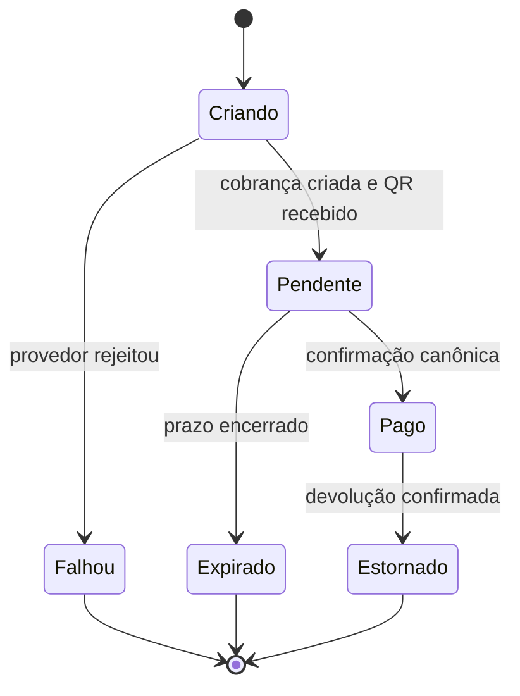

# Contraprova de Fechamento do Pix — Zuvvi

> Documento vivo de controle técnico, segurança de escopo e homologação.
>
> **Status geral:** ETAPA 2 — BLOQUEADA POR CONFIGURAÇÃO EXTERNA  
> **Data da linha de base:** 2026-08-28 (UTC)  
> **Responsável pela execução técnica:** Codex  
> **Responsável pela homologação manual:** Rafael  
> **Repositório:** `zuvvi-oficial/zuvvi-moto-ride`  
> **Branch controlada:** `fix/pix-fechamento-controlado`  
> **Base imutável da Etapa 0:** `main@4d8172c0d87688811f39dd630b11f0f0649a34e3`  
> **Supabase:** `qycblinfvijhfjcmdoof`  
> **Lovable:** `d981bf4e-a77d-4481-bac9-c1d9bcc7174c`

## 1. Objetivo único

Fechar ponta a ponta o pagamento de corridas por Pix, reutilizando exclusivamente a arquitetura e os objetos já existentes no Zuvvi, sem duplicar funcionalidades, sem criar fluxo paralelo, sem esconder falhas na interface e sem alterar partes funcionais fora do escopo.

O fechamento só será aceito quando:

1. o pedido de corrida Pix não gerar corrida presa ou órfã;
2. o Mercado Pago gerar QR Code e Pix Copia e Cola válidos;
3. pagamento rejeitado, expirado ou com erro terminar em estado coerente;
4. pagamento aprovado liberar exatamente a corrida correta;
5. passageiro e motorista receberem estados coerentes;
6. repetição de requisição ou webhook não duplicar cobrança nem efeito;
7. todas as contraprovas de banco, código, publicação e teste manual passarem.

## 2. Trava absoluta de escopo

### 2.1 Permitido

Somente alterações estritamente necessárias no fluxo Pix já existente:

- criação e estado da cobrança Pix;
- QR Code e Pix Copia e Cola;
- OAuth do Mercado Pago já existente por motorista;
- Device ID já existente;
- idempotência já existente;
- webhook e reconciliação já existentes;
- tabelas, funções e telas Pix já existentes;
- vínculo entre corrida Pix, pagamento Pix e tentativa Pix;
- bloqueio/liberação da corrida em função do estado financeiro;
- tratamento de falha, expiração, aprovação tardia e estorno, se já suportados pela arquitetura existente;
- configuração externa indispensável do Mercado Pago, Supabase e Lovable.

### 2.2 Congelado

Não alterar:

- painel administrativo;
- autenticação geral;
- mapas, GPS, rotas e geocodificação;
- tarifas e cálculo de preço;
- pagamento em dinheiro;
- cartões ou qualquer outro meio de pagamento;
- chat, suporte, documentação de motorista ou passageiro;
- design system;
- dependências sem necessidade comprovada;
- estrutura geral das telas funcionais do motorista e passageiro;
- objetos de banco que não participem diretamente do Pix;
- regras gerais da corrida que funcionem igualmente fora do Pix.

### 2.3 Proibido

- criar segunda tabela, segunda tela, segunda rota ou segundo processador para a mesma função;
- criar “fallback” com token da plataforma no lugar do OAuth do motorista;
- remover `application_fee` apenas para fazer a cobrança passar;
- marcar pagamento como pago manualmente;
- liberar corrida apenas pela interface sem confirmação financeira canônica;
- apagar corrida, pagamento, tentativa ou evento financeiro para esconder inconsistência;
- editar produção diretamente pelo painel;
- refatorar ou formatar arquivos sem relação direta com a etapa;
- misturar correções de etapas diferentes no mesmo commit;
- alterar `main` diretamente;
- publicar uma versão cujo SHA não tenha sido homologado;
- fazer migração repetida ou criar objeto “temporário” sem autorização expressa.

Qualquer diff fora da lista permitida reprova automaticamente a etapa.

## 3. Linha de base comprovada

### 3.1 Código e publicação

| Item | Estado em 2026-08-28 |
|---|---|
| GitHub `main` | `4d8172c0d87688811f39dd630b11f0f0649a34e3` |
| Lovable publicado | `607bf131ede73d7fb15f620905f6fd1d5afd98a3` |
| URL publicada | https://zuvvi-moto-ride.lovable.app |
| Situação | GitHub e publicação estão divergentes |
| Diferença já auditada | 18 arquivos diferentes; históricos divergentes |
| Testes atuais | testes Pix, TypeScript e build passam em código que ainda falha na produção |
| Conclusão | a suíte atual não prova o fechamento real do Pix |

O `main` já contém proteções que não estão na versão publicada, incluindo encerramento de cobrança rejeitada e saída da tela infinita de geração, além de validação de CPF. Nada será reimplementado antes de promover e provar o comportamento que já existe.

### 3.2 Banco de dados

Leitura não destrutiva realizada no Supabase em 2026-08-28:

| Métrica | Linha de base |
|---|---:|
| Corridas Pix | 51 |
| Pagamentos Pix | 51 |
| Tentativas Pix | 39 |
| Tentativas `falhou` | 38 |
| Tentativas `criando` | 1 |
| Pagamentos Pix `falhou` | 38 |
| Pagamentos Pix `pendente` | 13 |
| Corridas Pix `cancelada` | 49 |
| Corridas Pix `aceita` | 1 |
| Corridas Pix `sem_motorista` | 1 |
| Sessões Device ID válidas | 0 |
| Eventos de webhook registrados | 0 |
| Credenciais Mercado Pago `active`, não revogadas | 2 |
| Pagamentos Pix sem tentativa Pix | 12 |
| Corridas canceladas com pagamento pendente | 11 |
| Corridas operacionais Pix sem pagamento confirmado | 1 |
| Tentativas `criando` há mais de 10 minutos | 1 |
| Corridas Pix sem pagamento | 0 |
| Pagamentos Pix sem corrida | 0 |
| Tentativas sem pagamento | 0 |
| Corridas com múltiplos pagamentos Pix | 0 |
| IDs de pagamento Mercado Pago duplicados | 0 |
| Chaves de idempotência duplicadas | 0 |

A tentativa mais recente ficou em `criando`, sem ID de pagamento e sem QR Code, com:

- código interno: `internal_server_error`;
- retorno do provedor: `user_allowed_only_in_test : 400`;
- ocorrência: `2026-08-28 15:17:24 UTC`.

Isso comprova que o defeito atual não é apenas visual: o Mercado Pago rejeitou a criação, mas a versão publicada não encerrou corretamente o estado interno.

## 4. Arquitetura existente que deve ser preservada

A solução deve continuar usando os componentes existentes:

- OAuth Mercado Pago por motorista;
- tokens criptografados;
- propriedade exclusiva da conta Mercado Pago;
- `public.corridas`;
- `public.pagamentos`;
- `public.pagamentos_pix_tentativas`;
- `public.pagamentos_pix_device_sessions`;
- `private.motorista_mercadopago_credenciais`;
- `private.mercadopago_webhook_eventos`;
- funções/RPCs Pix existentes;
- handler de webhook existente;
- reconciliação canônica consultando a API do Mercado Pago;
- gate de pagamento existente antes do avanço da corrida;
- tela de QR Code existente;
- chaves de idempotência existentes.

A existência de `private.mercadopago_webhook_eventos` impede criar outra estrutura para auditoria/deduplicação. Se o handler não a utiliza corretamente, será corrigido para reutilizá-la.

## 5. Estado correto do fluxo

Regras invariáveis:

- `Criando` não pode permanecer indefinidamente;
- sem `mercadopago_payment_id` e sem QR, não existe cobrança utilizável;
- a interface nunca transforma `pendente` em `pago`;
- webhook é gatilho; a API canônica do Mercado Pago é a fonte financeira;
- o mesmo evento ou pedido repetido produz no máximo um efeito;
- corrida Pix não avança para operação sem pagamento confirmado;
- falha definitiva cancela/libera os participantes de forma coerente;
- aprovação tardia nunca pode ser ignorada.

## 6. Protocolo obrigatório de cada etapa

Antes de qualquer alteração:

1. reler este documento;
2. registrar o SHA do GitHub, SHA publicado e métricas do banco;
3. escrever a causa comprovada;
4. declarar a lista exata de arquivos e objetos permitidos para a etapa;
5. provar que não existe implementação equivalente a ser reaproveitada;
6. definir teste técnico, teste manual e consulta de contraprova;
7. só então alterar.

Depois de qualquer alteração:

1. revisar o diff completo;
2. reprovar se houver arquivo fora da lista;
3. executar testes unitários/integrados pertinentes;
4. executar TypeScript e build;
5. repetir as consultas de contraprova;
6. comparar resultado com a linha de base;
7. publicar somente o SHA aprovado;
8. Rafael executa o teste manual guiado;
9. registrar evidências e classificar a etapa.

Estados permitidos:

- **APROVADA:** código, banco, publicação e teste manual coerentes;
- **REPROVADA:** uma ou mais provas falharam; não avançar;
- **BLOQUEADA POR CONFIGURAÇÃO EXTERNA:** código está coerente, mas Mercado Pago, Lovable ou Supabase impede o teste; não mascarar com código.

Se reprovar, a correção continua dentro da mesma etapa. Toda a contraprova é repetida. Só uma etapa aprovada autoriza a próxima.

## 7. Contraprovas obrigatórias do banco

As consultas são somente leitura. Nenhum resultado pode ser “corrigido” apagando histórico.

| Contraprova | Condição final esperada |
|---|---:|
| Corrida Pix sem pagamento Pix | 0 |
| Pagamento Pix sem corrida | 0 |
| Tentativa Pix sem pagamento | 0 |
| Tentativa `criando` antiga | 0 |
| Pagamento pendente após falha definitiva | 0 para casos novos |
| Corrida cancelada com pagamento novo pendente | 0 para casos novos |
| Corrida operacional Pix sem pagamento pago | 0 |
| Múltiplos pagamentos Pix por corrida | 0 |
| ID Mercado Pago duplicado | 0 |
| Chave de idempotência duplicada | 0 |
| Motorista da tentativa diferente do motorista da corrida | 0 |
| QR utilizável após expiração | 0 |
| Aprovação tardia sem tratamento | 0 |
| Evento webhook repetido com efeito duplicado | 0 |

Histórico antigo será separado de casos criados na homologação. O caso preso atual só poderá ser regularizado depois de consulta canônica ao Mercado Pago e com evidência registrada.

## 8. Contraprovas obrigatórias do GitHub e da publicação

Para cada etapa:

- branch deve descender da base registrada;
- um commit lógico por etapa;
- nenhum commit direto em `main`;
- lista de arquivos alterados deve coincidir com a allowlist da etapa;
- diff deve conter somente mudança relacionada ao Pix;
- nenhuma dependência nova sem prova e autorização;
- testes existentes devem continuar passando;
- novos testes só podem provar o comportamento corrigido, sem duplicar implementação;
- SHA publicado deve ser exatamente o SHA homologado;
- comparação final deve provar que dinheiro, painel e fluxos não Pix não foram tocados.

## 9. Etapas de fechamento

### Etapa 0 — Documento, trava e linha de base

**Alteração permitida:** apenas este documento.  
**Banco:** nenhuma escrita.  
**Código funcional:** nenhuma alteração.  
**Publicação:** nenhuma.

Provas:

- branch criada a partir de `main@4d8172c`;
- documento versionado;
- linha de base de GitHub, Lovable e Supabase registrada;
- escopo congelado;
- nenhuma alteração funcional.

**Resultado:** APROVADA.

### Etapa 1 — Alinhar código homologado e publicação

Objetivo: provar primeiro as correções que já existem no `main`, sem reimplementá-las.

Allowlist deverá ser declarada antes da execução. Não haverá alteração de banco sem necessidade comprovada.

Teste manual de Rafael:

1. abrir a versão de homologação indicada;
2. solicitar uma corrida Pix com os dados de teste indicados;
3. aguardar o retorno rejeitado controlado;
4. confirmar que a tela “Gerando Pix” não fica infinita;
5. confirmar que passageiro recebe mensagem clara;
6. confirmar que a corrida é cancelada;
7. confirmar que o motorista fica livre.

Aprovação exige também: tentativa `falhou`, pagamento `falhou`, corrida `cancelada` e nenhuma nova corrida presa.

**Execução e contraprova — 2026-08-28:**

- causa já corrigida e reutilizada: commit `d8e769031f537f26fabfe6a2abbced859fcc6508`;
- commit sincronizado no fluxo Lovable: `57fad86ac8d71957a97af925a63ce4bb90c38d74`;
- allowlist cumprida: `scripts/pix/cobranca-pix-apos-aceite.test.ts`, `scripts/pix/pagamento-pix.test.ts`, `src/lib/pix-mercadopago-reconcile.server.ts` e `src/routes/pagamento-pix.tsx`;
- nenhum arquivo fora da allowlist;
- nenhuma escrita ou migração de banco;
- screenshot de Rafael comprovou a saída da espera infinita, mensagem clara e botão “Tentar novamente” na URL publicada;
- caso novo: tentativa `falhou`, pagamento `falhou`, corrida `cancelada`, motorista disponível;
- caso novo recebeu ID Mercado Pago e QR, mas terminou como falha; sua causa financeira será analisada na Etapa 2;
- nenhuma chave de idempotência duplicada;
- o caso legado de 15:17 UTC continua isolado na linha de base e não foi alterado.

**Resultado:** APROVADA.

### Etapa 2 — Geração real do QR Code

Objetivo: corrigir a coerência de ambiente/contas do Mercado Pago que causa `user_allowed_only_in_test`, preservando OAuth do motorista, CPF, Device ID, idempotência e comissão.

Não será permitido remover `application_fee` para contornar a configuração.

Teste manual de Rafael:

1. entrar com o passageiro de homologação indicado;
2. solicitar corrida Pix com motorista homologado;
3. confirmar QR Code visível;
4. confirmar Pix Copia e Cola não vazio;
5. usar o botão de copiar;
6. confirmar contagem regressiva e horário de validade;
7. sair e voltar à tela;
8. confirmar que o mesmo pagamento reaparece, sem segunda cobrança.

**Execução e contraprova — 2026-08-28:**

- a cobrança controlada devolveu Payment ID, QR Code, Pix Copia e Cola, ticket URL e validade de 24 horas;
- `application_fee` foi aceita na criação; não ocorreu erro `2059`;
- aproximadamente um segundo depois, o Mercado Pago alterou a cobrança para `rejected / rejected_high_risk`;
- o Zuvvi corretamente encerrou tentativa e pagamento como `falhou`, cancelou a corrida e liberou o motorista;
- as 15 ocorrências históricas de `rejected_high_risk` pertencem à mesma conta vendedora, com quatro passageiros e vários valores;
- o passageiro do teste possui nome, e-mail, telefone e CPF matematicamente válido;
- a sessão Device ID estava válida, normalizada e registrada antes da cobrança;
- OAuth do motorista está `active`, não revogado, não expirado e com propriedade interna coerente;
- a segunda conta de motorista disponível pertence a outro ambiente e retorna `user_allowed_only_in_test`;
- proteção já existente do commit `47048f8820d577785bde9e47a0a6741d14b3793c` foi sincronizada sem reimplementação;
- commit da Etapa 2: `be71f0f85a02b230c665a108f2f650d5b9bec354`;
- allowlist cumprida: um teste Pix e quatro arquivos server-side exclusivos de CPF/Device ID/Pix;
- nenhuma escrita ou migração manual de banco;
- nenhum arquivo do painel, dinheiro ou fluxo não Pix foi alterado.

**Classificação:** BLOQUEADA POR CONFIGURAÇÃO EXTERNA.

**Condição objetiva de liberação:** conectar pelo OAuth existente uma conta Mercado Pago vendedora real, verificada, elegível para Pix/Split, com chave Pix, diferente da conta da plataforma e das duas contas já diagnosticadas. Depois, repetir uma única cobrança controlada. O código não deve ser alterado para contornar `rejected_high_risk`.

### Etapa 3 — Confirmação de pagamento

Objetivo: provar webhook, consulta canônica, deduplicação e liberação da corrida usando os objetos existentes.

Itens de prova:

- assinatura HMAC do webhook validada;
- evento registrado na tabela já existente;
- repetição do evento sem efeito duplicado;
- estado consultado na API do Mercado Pago;
- tentativa e pagamento aprovados;
- corrida correta liberada;
- passageiro e motorista sincronizados.

Teste manual de Rafael: pagar um QR de homologação e confirmar, em ordem, a mudança de tela do passageiro e a liberação da mesma corrida para o motorista.

### Etapa 4 — Falha, expiração e órfãos

Objetivo: provar estados terminais e eliminar novos casos presos.

Cenários:

- rejeição na criação;
- expiração sem pagamento;
- cancelamento durante pendência, quando permitido;
- reabertura da tela;
- aprovação tardia;
- webhook repetido;
- falha temporária de rede;
- tentativa repetida do usuário;
- regularização segura do caso preso atual.

**Trava de arquitetura:** se webhook e reconciliação existentes não garantirem expiração com os aplicativos fechados, a etapa será marcada **BLOQUEADA**. Nenhum executor escondido será criado. Rafael deverá autorizar expressamente um único mecanismo mínimo antes de qualquer criação.

### Etapa 5 — Homologação final e fechamento

Matriz mínima:

- motorista A com conta Mercado Pago A;
- motorista B com conta Mercado Pago B;
- passageiro não acessa pagamento de outro passageiro;
- motorista não recebe pagamento de outro motorista;
- pedido repetido não duplica cobrança;
- webhook repetido não duplica efeito;
- pendente não libera corrida;
- pago libera exatamente uma corrida;
- rejeitado e expirado não prendem corrida;
- dinheiro continua funcionando;
- nenhum arquivo do painel foi alterado;
- SHA publicado é o SHA aprovado.

Só depois disso: revisão final, merge controlado e publicação definitiva.

## 10. Política de banco e rollback

- toda mudança DDL será migração nomeada, revisada e aplicada uma vez;
- antes de DDL, serão salvas as definições atuais dos objetos afetados, grants e dependências;
- nenhuma tabela financeira será truncada;
- nenhum histórico será apagado;
- correção de dados exigirá consulta canônica ao provedor e filtro por registros exatos;
- rollback de código será por commit da etapa;
- rollback de banco será por migração corretiva para frente, preservando evidência;
- falha de uma etapa interrompe publicação e impede avanço.

## 11. Registro de evidências

| Etapa | GitHub base | Banco escrito? | Código funcional alterado? | Publicado? | Resultado |
|---|---|---:|---:|---:|---|
| 0 | `4d8172c0d87688811f39dd630b11f0f0649a34e3` | Não | Não | Não | APROVADA |
| 1 | `607bf131` → `57fad86a` | Não | Sim, somente 2 arquivos Pix + 2 testes | Sim, SHA sincronizado e comprovado por screenshot | APROVADA |
| 2 | `57fad86a` → `be71f0f8` | Não | Sim, somente CPF/Device ID/Pix existente | Sim, SHA sincronizado | BLOQUEADA POR CONFIGURAÇÃO EXTERNA |
| 3 | a preencher | — | — | — | PENDENTE |
| 4 | a preencher | — | — | — | PENDENTE |
| 5 | a preencher | — | — | — | PENDENTE |

## 12. Regra de fechamento

O Pix só será declarado “100% funcional” quando todas as etapas estiverem **APROVADAS**, a matriz final estiver completa, as métricas de casos novos estiverem zeradas para inconsistências, o SHA publicado for o homologado e Rafael concluir o teste guiado final.

Até lá, qualquer resultado parcial será descrito pelo estado real. QR exibido não significa pagamento fechado; pagamento aprovado no provedor não significa corrida sincronizada; teste automatizado verde não substitui a contraprova real.

---

## 13. PRIORIDADE IMEDIATA — Corrida Pix presa, persistência e avisos aos dois lados

> **Classificação:** microetapa corretiva prioritária, anterior à retomada da Etapa 2.  
> **Status:** PLANEJADA — nenhuma alteração funcional autorizada por este registro documental.  
> **Regra de retomada:** somente depois desta prioridade ser aprovada a execução retorna ao ponto anterior da contraprova: Etapa 2 bloqueada por configuração externa do Mercado Pago.

### 13.1 Motivo da prioridade

Em 2026-08-28 foi comprovada uma inconsistência operacional real:

- corrida Pix criada às 15:17 UTC permaneceu em `aceita`;
- pagamento permaneceu em `pendente`;
- tentativa Pix permaneceu em `criando`;
- Mercado Pago recusou a criação com `user_allowed_only_in_test : 400`;
- não houve Payment ID nem QR Code;
- passageiro e motorista ficaram vinculados a uma corrida sem cobrança utilizável;
- o passageiro voltou a entrar às 17:43 UTC;
- o núcleo bloqueou corretamente uma segunda solicitação porque encontrou corrida em andamento;
- a corrida antiga não foi retomada nem exibida de modo persistente na tela do passageiro;
- o motorista disponível consultou ofertas normalmente, mas não recebeu pedido novo porque nenhuma nova corrida pôde ser criada.

Conclusão: a trava contra duas corridas funciona, mas a compensação e a projeção visual não fecharam o primeiro fluxo. O passageiro ficou bloqueado por uma corrida invisível.

### 13.2 Objetivo fechado

Garantir que toda corrida Pix esteja sempre em exatamente uma destas condições:

1. **cobrança pendente e utilizável:** corrida e pagamento reaparecem ao reabrir o aplicativo;
2. **pagamento confirmado:** corrida é liberada para operação;
3. **falha terminal confirmada:** tentativa e pagamento falham, corrida é cancelada, motorista é liberado e os dois usuários recebem aviso persistente;
4. **resultado incerto:** nenhuma nova cobrança é criada e o caso permanece em reconciliação até confirmação canônica.

É proibido existir corrida ativa invisível, corrida cancelada com pagamento pendente, motorista ocupado por cobrança inexistente ou passageiro bloqueado sem explicação.

### 13.3 Inventário existente confirmado

A correção deve reutilizar:

- RPC `public.pix_charge_failure_compensate`;
- `public.corridas`;
- `public.pagamentos`;
- `public.pagamentos_pix_tentativas`;
- `public.notificacoes`;
- tipo existente de notificação `corrida_cancelada`;
- `src/lib/notificacoes.server.ts`;
- `src/components/NotificationBell.tsx`;
- `src/lib/pagamento-pix-status.functions.ts`;
- tela existente `/pagamento-pix`;
- telas existentes de início do passageiro e motorista;
- reconciliação canônica existente do Mercado Pago;
- trigger `pix_guard_operational_before_payment_trigger`.

Não criar nova tabela, nova central de notificações, segunda função de compensação, segunda tela de pagamento ou rota paralela.

### 13.4 Capacidade atual da compensação

A RPC existente já executa sob bloqueio transacional e, quando não existe cobrança externa conhecida:

1. valida corrida, motorista, tentativa e pagamento;
2. bloqueia compensação se existir Payment ID;
3. exige corrida Pix em `aceita` ou `aguardando_pagamento`;
4. exige pagamento `pendente` e tentativa `criando`;
5. marca tentativa `falhou`;
6. marca pagamento `falhou`;
7. cancela a corrida;
8. libera o motorista aprovado.

A correção deve fortalecer esse caminho existente, sem substituí-lo. Casos com Payment ID continuam obrigados a passar pela consulta canônica e pelo caminho de sincronização já existente.

### 13.5 Invariantes obrigatórias

- Falha terminal sem cobrança externa fecha todos os estados na mesma transação.
- Falha terminal com Payment ID só fecha após consulta canônica.
- Timeout, indisponibilidade e erro de rede não são tratados como rejeição.
- Repetir compensação, webhook ou reconciliação não duplica efeito nem aviso.
- Disponibilidade do motorista não depende de tocar na notificação.
- Aviso não substitui estado de banco.
- Passageiro nunca é liberado apenas porque fechou ou recarregou o aplicativo.
- Dinheiro e cartão não entram nesta lógica.
- Uma corrida Pix pendente e válida deve ser retomada, não recriada.
- Uma corrida Pix terminal deve permanecer consultável como desfecho, sem bloquear nova solicitação.

### 13.6 Avisos persistentes

#### Passageiro

**Título:** Pagamento não concluído

**Mensagem:** O Mercado Pago não confirmou o pagamento. Por segurança, esta corrida foi cancelada e nenhum valor foi confirmado. Solicite uma nova corrida e tente novamente ou escolha outra forma de pagamento.

Ações nas telas existentes:

- **Solicitar nova corrida**
- **Escolher outra forma de pagamento**

#### Motorista

**Título:** Corrida cancelada

**Mensagem:** O pagamento Pix do passageiro não foi confirmado. A corrida foi cancelada automaticamente e você já está disponível para receber novas solicitações.

Ação na tela existente:

- **Voltar a receber corridas**

Regras dos avisos:

- usar `public.notificacoes` e `NotificationBell`;
- tipo existente `corrida_cancelada`;
- vincular à corrida;
- iniciar como `lida = false`;
- continuar disponível após fechar e abrir o aplicativo;
- não expor CPF, e-mail, valor sensível, status interno ou diagnóstico técnico ao motorista;
- impedir duas notificações iguais para o mesmo evento terminal;
- a interface persistente da corrida deve funcionar mesmo se o usuário apagar a notificação da central.

### 13.7 Persistência no aplicativo do passageiro

Ao entrar ou retornar ao início, o fluxo existente deverá consultar o estado real antes de permitir nova solicitação:

- corrida Pix ativa e pagamento pendente utilizável: retomar `/pagamento-pix`;
- pagamento pago: encaminhar ao acompanhamento;
- tentativa/pagamento falhos e corrida cancelada: mostrar desfecho persistente e liberar nova solicitação;
- estado incerto: mostrar análise/reconciliação, sem criar segunda cobrança;
- corrida antiga ativa sem cobrança utilizável: acionar o caminho seguro de recuperação, nunca esconder.

A tela inicial não poderá tratar “nenhuma corrida visível” como “nenhuma corrida ativa” sem conferir o servidor.

### 13.8 Persistência no aplicativo do motorista

O aplicativo do motorista deverá:

- receber atualização da corrida cancelada pelo mecanismo existente;
- remover a corrida da área operacional;
- atualizar a disponibilidade automaticamente;
- registrar e exibir notificação persistente;
- não oferecer botões de chegada, início ou conclusão para corrida cancelada;
- continuar consultando novas ofertas depois da liberação.

O aviso é informativo; ele não controla a liberação financeira ou operacional.

### 13.9 Ordem de execução

#### Fase A — Contraprova pré-mudança

- salvar SHA do GitHub e Lovable;
- fotografar métricas de órfãos;
- salvar definição, grants e dependências da RPC afetada;
- declarar allowlist final;
- identificar exatamente onde o aviso já é criado em cancelamentos comuns;
- provar que dinheiro, cartão e painel não compartilham o trecho a alterar.

#### Fase B — Fechamento atômico

- ajustar somente o caminho existente de falha terminal;
- manter bloqueio para cobrança externa conhecida;
- inserir os dois avisos persistentes no mesmo resultado lógico;
- garantir idempotência de estado e notificação;
- manter erros incertos em reconciliação.

#### Fase C — Retomada das telas

- usar o snapshot Pix existente no passageiro;
- restaurar corrida pendente ao reabrir;
- mostrar desfecho terminal antes de liberar novo pedido;
- atualizar corrida e disponibilidade no motorista;
- reutilizar central de notificações e componentes atuais.

#### Fase D — Regularização do caso legado

Somente depois do código aprovado:

1. consultar canonicamente o Mercado Pago;
2. comprovar ausência de cobrança externa;
3. executar `pix_charge_failure_compensate` com os IDs exatos;
4. conferir tentativa `falhou`;
5. conferir pagamento `falhou`;
6. conferir corrida `cancelada`;
7. conferir motorista disponível;
8. conferir avisos persistentes;
9. confirmar que o passageiro consegue iniciar nova solicitação.

Nenhuma tabela será atualizada manualmente em comandos separados.

### 13.10 Allowlist candidata

A allowlist final deve ser igual ou menor que esta lista:

- `src/lib/pagamento.server.ts`;
- `src/lib/pagamento-pix-status.functions.ts`;
- `src/lib/notificacoes.server.ts`;
- `src/routes/pagamento-pix.tsx`;
- trecho estritamente necessário da tela inicial do passageiro;
- trecho estritamente necessário de `src/routes/home-motorista.tsx`;
- testes Pix já existentes;
- uma migração corretiva da RPC existente, apenas se a análise provar necessidade.

Todo arquivo removido da necessidade deve sair da allowlist. Nenhum arquivo administrativo, mapa, tarifa, dinheiro, cartão, chat, suporte, design system ou dependência poderá entrar.

### 13.11 Matriz técnica de contraprova

| Cenário | Resultado obrigatório |
|---|---|
| Erro 400 definitivo sem Payment ID | tentativa falha, pagamento falha, corrida cancela, motorista libera |
| `rejected` com Payment ID | consulta canônica antes do fechamento |
| Timeout ou erro de rede | não cancelar e não criar segunda cobrança |
| Compensação repetida | nenhum segundo efeito |
| Webhook repetido | nenhum segundo efeito ou aviso |
| Passageiro fecha e reabre com Pix pendente | mesma cobrança reaparece |
| Passageiro fecha e reabre após falha | desfecho aparece e nova corrida é permitida |
| Motorista fecha e reabre após falha | aviso aparece e motorista está disponível |
| Tentativa de iniciar corrida sem pagamento | trigger bloqueia |
| Corrida em dinheiro | comportamento permanece igual |
| Painel administrativo | zero arquivos alterados |
| Corrida Pix invisível ativa | zero casos novos |
| Corrida cancelada com pagamento novo pendente | zero casos novos |
| Chave de idempotência duplicada | zero |

### 13.12 Teste manual guiado de Rafael

1. solicitar uma corrida Pix controlada;
2. motorista aceitar;
3. provocar o cenário de falha definido para homologação;
4. confirmar mensagem persistente no passageiro;
5. fechar e abrir o aplicativo do passageiro;
6. confirmar que o desfecho continua visível;
7. solicitar nova corrida ou escolher outro meio;
8. confirmar mensagem persistente no motorista;
9. fechar e abrir o aplicativo do motorista;
10. confirmar que o aviso continua e novas ofertas podem ser recebidas;
11. executar uma corrida em dinheiro para contraprova de regressão.

### 13.13 Critérios de aprovação

A prioridade só será aprovada quando:

- o caso legado estiver encerrado com prova canônica;
- nenhuma corrida Pix nova ficar presa ou invisível;
- os dois aplicativos persistirem o estado correto;
- motorista e passageiro forem liberados automaticamente após falha terminal;
- nenhum aviso for duplicado;
- dinheiro continuar funcionando;
- diff respeitar a allowlist;
- banco, código, Lovable e teste manual apresentarem o mesmo resultado.

### 13.14 Rollback

- um commit funcional controlado;
- migração corretiva para frente se houver alteração de RPC;
- preservar definição anterior, grants e evidências;
- não apagar notificações, pagamentos, tentativas ou corridas;
- se qualquer contraprova falhar, não publicar e não avançar;
- depois da aprovação, registrar SHA, métricas e evidência nesta seção.

### 13.15 Regra de prioridade

Enquanto esta microetapa estiver pendente, reprovada ou bloqueada:

- não iniciar Etapa 3;
- não retomar o teste financeiro da Etapa 2;
- não limpar manualmente corridas para continuar testes;
- não criar novos mecanismos paralelos.

Depois de aprovada, retornar exatamente à **Etapa 2 — bloqueada por configuração externa do Mercado Pago**, preservando todo o restante deste documento.
